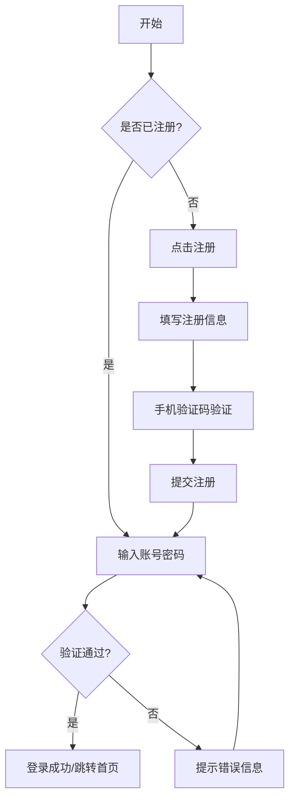
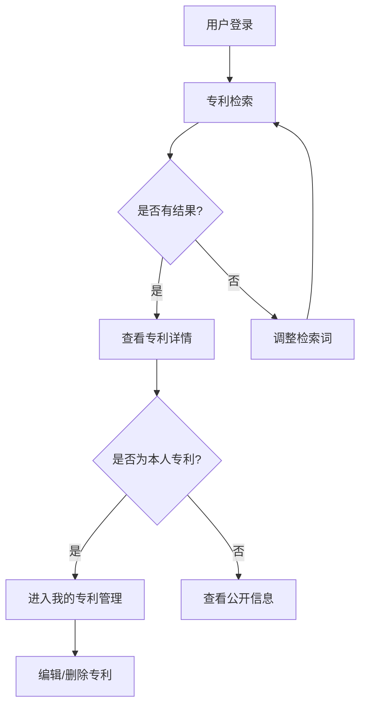
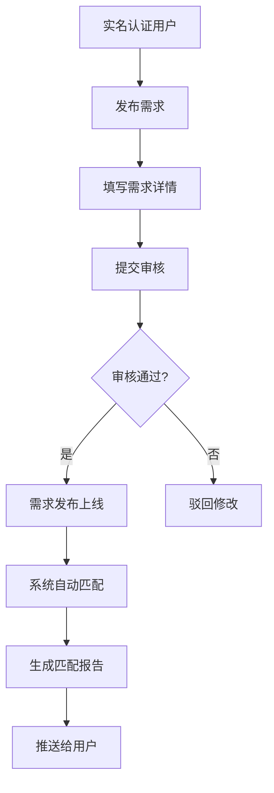
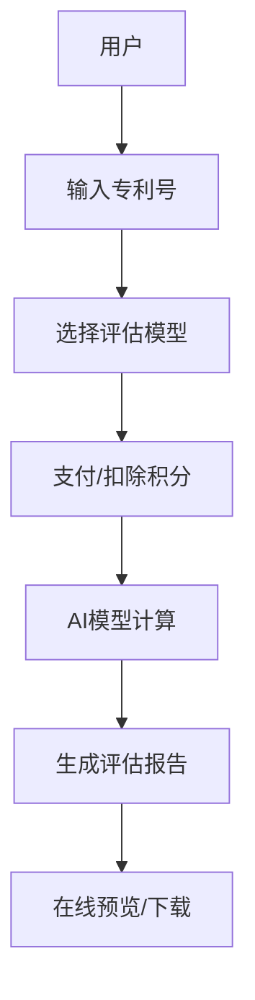

# 我的知识产权平台 V1.0 软件说明书

**文档编号**：IP-MANUAL-2026-V1.0  
**版本号**：V1.0  
**发布日期**：2026-03-03  
**密级**：公开

---

# 目录

1.  [引言](#1-引言)
    1.1 [编写目的](#11-编写目的)
    1.2 [背景](#12-背景)
    1.3 [定义](#13-定义)
    1.4 [参考资料](#14-参考资料)
2.  [系统概述](#2-系统概述)
    2.1 [系统简介](#21-系统简介)
    2.2 [系统架构](#22-系统架构)
    2.3 [主要功能清单](#23-主要功能清单)
    2.4 [性能指标](#24-性能指标)
3.  [运行环境与安装](#3-运行环境与安装)
    3.1 [硬件环境](#31-硬件环境)
    3.2 [软件环境](#32-软件环境)
    3.3 [网络环境](#33-网络环境)
    3.4 [浏览器兼容性](#34-浏览器兼容性)
4.  [业务流程图解](#4-业务流程图解)
    4.1 [用户注册登录流程](#41-用户注册登录流程)
    4.2 [专利检索与管理流程](#42-专利检索与管理流程)
    4.3 [需求发布与匹配流程](#43-需求发布与匹配流程)
    4.4 [专利价值评估流程](#44-专利价值评估流程)
5.  [用户操作指南](#5-用户操作指南)
    5.1 [系统访问与注册](#51-系统访问与注册)
        5.1.1 [系统访问](#511-系统访问)
        5.1.2 [用户注册](#512-用户注册)
        5.1.3 [用户登录](#513-用户登录)
        5.1.4 [找回密码](#514-找回密码)
    5.2 [个人中心](#52-个人中心)
        5.2.1 [个人信息查看](#521-个人信息查看)
        5.2.2 [修改个人资料](#522-修改个人资料)
        5.2.3 [实名认证](#523-实名认证)
        5.2.4 [安全设置](#524-安全设置)
    5.3 [专利检索子系统](#53-专利检索子系统)
        5.3.1 [功能概述](#531-功能概述)
        5.3.2 [基础检索](#532-基础检索)
        5.3.3 [高级检索](#533-高级检索)
        5.3.4 [检索结果列表](#534-检索结果列表)
        5.3.5 [专利详情查看](#535-专利详情查看)
    5.4 [专利管理子系统](#54-专利管理子系统)
        5.4.1 [我的专利列表](#541-我的专利列表)
        5.4.2 [添加专利](#542-添加专利)
        5.4.3 [编辑专利](#543-编辑专利)
        5.4.4 [删除专利](#544-删除专利)
    5.5 [需求发布与匹配子系统](#55-需求发布与匹配子系统)
        5.5.1 [发布技术需求](#551-发布技术需求)
        5.5.2 [需求管理](#552-需求管理)
        5.5.3 [智能匹配专利](#553-智能匹配专利)
        5.5.4 [智能匹配专家](#554-智能匹配专家)
    5.6 [专家库子系统](#56-专家库子系统)
        5.6.1 [专家检索](#561-专家检索)
        5.6.2 [专家详情查看](#562-专家详情查看)
        5.6.3 [专家入驻申请](#563-专家入驻申请)
    5.7 [价值评估子系统](#57-价值评估子系统)
        5.7.1 [发起评估](#571-发起评估)
        5.7.2 [评估报告查看](#572-评估报告查看)
        5.7.3 [历史评估记录](#573-历史评估记录)
    5.8 [成果转化子系统](#58-成果转化子系统)
        5.8.1 [转化成果展示](#581-转化成果展示)
        5.8.2 [发布转化成果](#582-发布转化成果)
    5.9 [AI 智能咨询](#59-ai-智能咨询)
        5.9.1 [开启咨询](#591-开启咨询)
        5.9.2 [多轮对话](#592-多轮对话)
        5.9.3 [会话管理](#593-会话管理)
6.  [特色功能深度解析](#6-特色功能深度解析)
    6.1 [基于 Elasticsearch 的智能搜索引擎](#61-基于-elasticsearch-的智能搜索引擎)
    6.2 [多维度专利价值评估模型](#62-多维度专利价值评估模型)
    6.3 [基于 LLM 的智能问答助手](#63-基于-llm-的智能问答助手)
7.  [常见问题与故障处理](#7-常见问题与故障处理)
    7.1 [账号与登录问题](#71-账号与登录问题)
    7.2 [业务操作问题](#72-业务操作问题)
    7.3 [技术故障排除](#73-技术故障排除)
8.  [安全与隐私说明](#8-安全与隐私说明)
    8.1 [数据安全](#81-数据安全)
    8.2 [隐私保护](#82-隐私保护)
9.  [附录](#9-附录)
    9.1 [系统状态码表](#91-系统状态码表)
    9.2 [联系方式](#92-联系方式)

---

# 1. 引言

## 1.1 编写目的

本文档旨在为“我的知识产权”平台（以下简称“本平台”）的最终用户、系统管理员及运维人员提供全面、详细的操作指南和技术说明。通过本文档，用户可以快速了解平台的功能架构，掌握各项业务操作流程，解决使用过程中遇到的常见问题，从而充分发挥平台在知识产权管理、检索、评估及转化方面的价值。

本文档不仅作为用户操作手册，也是系统验收、培训及后期维护的重要依据。通过详细的步骤说明、界面截图和注意事项提示，确保不同技术背景的用户都能轻松上手。

## 1.2 背景

随着全球科技竞争的加剧，知识产权（Intellectual Property, IP）已成为国家和企业发展的核心战略资源。然而，在传统的知识产权运营过程中，普遍存在以下痛点：
1.  **信息孤岛**：专利数据分散在不同数据库，缺乏统一的高效检索入口，导致信息获取成本高昂。
2.  **供需匹配难**：高校与科研院所的专利成果难以精准触达企业需求，转化率低，大量优质专利处于“沉睡”状态。
3.  **价值评估难**：缺乏科学、客观、自动化的专利价值评估体系，交易定价困难，买卖双方难以达成共识。
4.  **服务效率低**：传统的人工咨询服务响应慢、成本高，无法满足海量用户的即时需求，且服务质量参差不齐。

为解决上述问题，本项目开发了“我的知识产权”平台。该平台利用大数据、人工智能（AI）及搜索引擎技术，整合海量专利数据与专家资源，构建了一个集检索、管理、评估、交易、咨询于一体的综合性服务生态系统。

## 1.3 定义

*   **专利检索（Patent Search）**：指用户通过关键词、分类号等条件，在平台数据库中查找相关专利信息的行为。
*   **智能匹配（Intelligent Matching）**：指系统利用 AI 算法，分析用户发布的技术需求，自动推荐高度相关的专利成果或领域专家的功能。
*   **价值评估（Valuation）**：指系统基于预设的评估模型（如市场法、收益法等），综合各项指标对专利的市场价值进行量化评分的过程。
*   **AI 咨询（AI Consultation）**：指基于大语言模型（LLM）的智能对话机器人，为用户提供 24 小时在线的法律法规、业务流程问答服务。
*   **Elasticsearch (ES)**：一种分布式、RESTful 风格的搜索和数据分析引擎，本平台用其实现高性能的专利全文检索。

## 1.4 参考资料

1.  《中华人民共和国专利法》（2020年修正）
2.  《知识产权强国建设纲要（2021—2035年）》
3.  《我的知识产权平台需求规格说明书 V1.0》
4.  《我的知识产权平台 API 接口文档 V7.0》
5.  《我的知识产权平台数据库设计文档 V1.0》

---

# 2. 系统概述

## 2.1 系统简介

“我的知识产权”是一个面向高校、科研机构、企业及个人发明人的全方位知识产权运营服务平台。平台采用先进的 B/S（Browser/Server）架构，用户无需安装任何客户端软件，通过浏览器即可随时随地访问。

平台核心致力于打通知识产权成果转化的“最后一公里”，通过数字化手段连接技术供给端与需求端，提供从专利挖掘、申请、管理到评估、交易的全生命周期服务。

## 2.2 系统架构

本平台采用前后端分离的微服务架构设计，确保系统的高内聚、低耦合及良好的可扩展性。

*   **前端层（Frontend）**：基于 Vue 3 + TypeScript + Vite 构建，采用 Arco Design / Element Plus 组件库，提供响应式、现代化的用户界面。前端负责页面展示、用户交互及数据请求。
*   **后端层（Backend）**：基于 Spring Boot 框架，提供 RESTful API 接口，负责业务逻辑处理、数据校验及权限控制。
*   **数据层（Data Layer）**：
    *   **MySQL**：存储用户数据、业务记录、配置信息等结构化数据。
    *   **Redis**：用于缓存热点数据、Session 管理及分布式锁，提升系统响应速度。
    *   **Elasticsearch**：存储海量专利文本数据，提供毫秒级的全文检索能力。
*   **AI 服务层**：集成大语言模型（如 DeepSeek、Qwen 等），提供智能问答、文本分析与匹配服务。

## 2.3 主要功能清单

| 模块 | 子功能 | 功能描述 | 适用用户 |
| :--- | :--- | :--- | :--- |
| **用户中心** | 注册登录 | 支持账号密码登录、手机号注册。 | 所有用户 |
| | 个人资料 | 管理昵称、头像、联系方式、实名认证信息。 | 所有用户 |
| | 安全设置 | 修改密码、绑定邮箱/手机。 | 所有用户 |
| **专利检索** | 基础检索 | 支持关键词全文检索、一句话智能搜索。 | 所有用户 |
| | 高级检索 | 支持按专利类型、申请日、申请人等组合筛选。 | 所有用户 |
| | 详情查看 | 展示专利摘要、权利要求、法律状态、同族专利等。 | 所有用户 |
| **专利管理** | 我的专利 | 用户对自己名下的专利进行增删改查。 | 注册用户 |
| | 批量导入 | 支持 Excel/CSV 格式批量导入专利数据（规划中）。 | 企业用户 |
| **需求匹配** | 需求发布 | 发布技术难题、合作需求，支持富文本描述。 | 实名用户 |
| | 智能匹配 | 系统自动推荐与需求匹配的专利和专家。 | 实名用户 |
| | 结果管理 | 保存、导出匹配结果，发起对接申请。 | 实名用户 |
| **专家库** | 专家查询 | 按领域、姓名查询专家信息。 | 所有用户 |
| | 专家详情 | 查看专家研究方向、发表论文、授权专利。 | 所有用户 |
| **价值评估** | 在线评估 | 输入专利号，系统自动生成价值评估报告。 | 注册用户 |
| | 报告下载 | 支持 PDF 格式下载评估报告。 | 注册用户 |
| **AI 咨询** | 智能对话 | 提供法律法规、申请流程、侵权判定等咨询。 | 所有用户 |
| | 会话管理 | 保存历史对话记录，支持多会话切换。 | 注册用户 |

## 2.4 性能指标

*   **系统可用性**：> 99.9%，支持 7x24 小时不间断运行。
*   **平均响应时间**：< 500ms（常规业务），< 1s（复杂检索）。
*   **并发用户数**：支持 1000+ 在线用户并发访问。
*   **数据存储量**：支持亿级专利数据存储与检索，单表数据量支持千万级。
*   **安全性**：通过等保三级认证，数据传输全程加密。

---

# 3. 运行环境与安装

## 3.1 硬件环境

为了保证平台的流畅运行，建议用户终端满足以下最低配置：

*   **CPU**：双核 2.0GHz 及以上（推荐四核 i5 及以上）
*   **内存**：4GB 及以上（推荐 8GB）
*   **硬盘**：剩余空间 1GB 以上（用于浏览器缓存）
*   **显示器**：分辨率 1366x768 及以上（推荐 1920x1080）

## 3.2 软件环境

本平台为 Web 应用，依赖于浏览器运行环境。

*   **操作系统**：Windows 7/10/11, macOS 10.12+, Linux (Ubuntu/CentOS), Android/iOS (移动端)
*   **浏览器**：
    *   Google Chrome 80+（推荐，兼容性最好）
    *   Mozilla Firefox 70+
    *   Microsoft Edge 80+
    *   Apple Safari 13+

## 3.3 网络环境

*   建议使用宽带互联网接入。
*   网络带宽建议不低于 4Mbps。
*   网络延迟建议低于 100ms。
*   若在企业内网使用，请确保防火墙允许访问平台域名及相关端口（80/443）。

## 3.4 浏览器兼容性说明

本平台大量使用了 HTML5、CSS3 及 ES6+ 新特性，**不支持** Internet Explorer (IE) 浏览器（包括 IE11）。请用户务必使用上述推荐的现代浏览器访问，以获得最佳的视觉效果和交互体验。

---

# 4. 业务流程图解

为了帮助用户更好地理解平台的核心业务逻辑，本章节提供了关键业务流程的图解说明。

## 4.1 用户注册登录流程

1.  用户访问平台首页。
2.  未注册用户需先进行注册，必须验证手机号以确保账号真实性。
3.  已注册用户直接输入账号密码登录。
4.  登录成功后，系统生成 Token 并存储，用户可访问受限资源。

## 4.2 专利检索与管理流程

## 4.3 需求发布与匹配流程

## 4.4 专利价值评估流程

---

# 5. 用户操作指南

本章节将详细介绍平台各功能模块的具体操作步骤。

## 5.1 系统访问与注册

### 5.1.1 系统访问

1.  打开浏览器（推荐 Chrome）。
2.  在地址栏输入平台网址：
    *   **正式环境**：`http://www.my-ip-platform.com`（示例）
    *   **测试环境**：`http://60.205.242.113`
3.  按回车键，即可进入平台首页。

> **[此处插入首页界面截图]**
> *图 5-1 平台首页*

### 5.1.2 用户注册

若您是首次使用本平台，需要注册一个账号。

**操作步骤**：
1.  在首页右上角点击【注册】按钮。
2.  进入注册页面，填写以下信息：
    *   **用户名**：必填，4-20位字符，支持字母、数字。
    *   **密码**：必填，6-20位字符，建议包含字母和数字。
    *   **确认密码**：再次输入密码，需与上方一致。
    *   **手机号**：必填，用于接收验证码和重要通知。
    *   **验证码**：点击“获取验证码”，输入收到的短信验证码。
3.  勾选“我已阅读并同意《用户服务协议》和《隐私政策》”。
4.  点击【立即注册】按钮。
5.  注册成功后，系统将自动跳转至登录页。

**界面字段说明**：

| 字段名称 | 必填 | 格式要求 | 说明 |
| :--- | :--- | :--- | :--- |
| 用户名 | 是 | 4-20字符 | 唯一标识，注册后不可修改 |
| 密码 | 是 | 6-20字符 | 建议字母+数字组合 |
| 手机号 | 是 | 11位数字 | 需为中国大陆有效手机号 |
| 验证码 | 是 | 6位数字 | 有效期5分钟 |

> **[此处插入注册页面截图]**
> *图 5-2 用户注册页面*

### 5.1.3 用户登录

1.  在首页右上角点击【登录】按钮。
2.  输入已注册的**用户名/手机号**。
3.  输入**密码**。
4.  （可选）勾选“记住我”，以便下次自动登录（公共电脑请勿勾选）。
5.  点击【登录】按钮。
6.  登录成功后，页面右上角将显示您的头像和昵称。

> **[此处插入登录页面截图]**
> *图 5-3 用户登录页面*

### 5.1.4 找回密码

若忘记登录密码，可通过以下步骤重置：

1.  在登录页点击右下角的“忘记密码？”链接。
2.  输入注册时的手机号。
3.  点击“获取验证码”并输入。
4.  设置新密码并确认。
5.  点击【重置密码】，成功后使用新密码登录。

## 5.2 个人中心

登录后，点击右上角头像，选择【个人中心】进入。

### 5.2.1 个人信息查看

在“个人资料”标签页，您可以查看当前账号的基础信息，包括：
*   用户 ID
*   用户名
*   当前昵称
*   绑定的手机号
*   绑定的邮箱
*   实名认证状态

> **[此处插入个人中心-基本信息截图]**
> *图 5-4 个人信息查看*

### 5.2.2 修改个人资料

1.  在“个人资料”页面，点击【编辑资料】按钮。
2.  输入新的**昵称**。
3.  点击头像区域，选择本地图片上传新头像（支持 JPG/PNG 格式，大小不超过 2MB）。
4.  点击【保存更改】按钮，系统提示“更新成功”。

### 5.2.3 实名认证

为了使用发布需求、专家入驻等高级功能，建议完成实名认证。

1.  切换到“实名认证”标签页。
2.  填写真实姓名。
3.  填写身份证号码。
4.  上传身份证正反面照片（可选，视具体安全策略而定）。
5.  点击【提交认证】。系统将在 1-3 个工作日内完成审核。

### 5.2.4 安全设置

1.  切换到“安全设置”标签页。
2.  **修改密码**：输入旧密码、新密码及确认密码，点击保存。
3.  **绑定邮箱**：输入邮箱地址，点击发送验证邮件，点击邮件中的链接完成绑定。

## 5.3 专利检索子系统

这是平台最核心的功能之一，提供强大的专利搜索能力。

### 5.3.1 功能概述

专利检索子系统基于 Elasticsearch 构建，支持亿级数据的毫秒级响应。用户可以通过自然语言描述、关键词组合或分类号进行检索。

### 5.3.2 基础检索

1.  点击顶部导航栏的【专利检索】。
2.  在搜索框中输入关键词，例如：“锂离子电池 隔膜”。
3.  （可选）在左侧下拉框选择专利类别（如“发明专利”、“实用新型”）。
4.  点击【搜索】按钮。

**检索技巧**：
*   支持空格分隔多个关键词（逻辑与）。
*   支持输入专利号精确查找。

> **[此处插入专利检索首页截图]**
> *图 5-5 专利检索首页*

### 5.3.3 高级检索

点击搜索框右侧的【高级检索】链接，展开高级筛选面板。支持以下条件组合：
*   **申请号/公开号**：精确匹配。
*   **申请人/专利权人**：如“华为技术有限公司”。
*   **发明人**：如“张三”。
*   **IPC分类号**：如“H01M”。
*   **申请日范围**：选择起始日期和结束日期。
*   **法律状态**：有效、无效、审中。

### 5.3.4 检索结果列表

检索结果将以列表形式展示，包含以下信息：
*   **专利名称**：高亮显示匹配的关键词。
*   **公开号**：点击可复制。
*   **申请日**。
*   **申请人**。
*   **摘要**：显示前 200 字摘要。

**操作**：
*   **排序**：点击右上角的排序按钮，可按“相关度”、“申请日降序”、“申请日升序”排序。
*   **分页**：底部提供分页器，支持跳转页码。

> **[此处插入检索结果列表截图]**
> *图 5-6 检索结果列表*

### 5.3.5 专利详情查看

在结果列表中点击任意专利标题，进入详情页。详情页包含：
*   **基本信息**：标题、摘要、主权项。
*   **著录项目**：申请号、公开号、申请日、公开日、分类号等。
*   **法律状态**：展示专利的历史法律状态变更记录。
*   **全文下载**：点击【下载全文】按钮，可下载 PDF 格式的专利说明书（需登录）。

> **[此处插入专利详情页截图]**
> *图 5-7 专利详情页*

## 5.4 专利管理子系统

用户可以在此管理自己名下的专利资产。

### 5.4.1 我的专利列表

1.  进入【个人中心】，点击左侧菜单的【我的专利】。
2.  列表展示您上传或认领的专利，包括专利号、名称、状态等。

### 5.4.2 添加专利

1.  在“我的专利”页面，点击右上角的【添加专利】按钮。
2.  填写专利信息表单：
    *   **专利名称**（必填）。
    *   **专利类型**（发明/实用/外观）。
    *   **专利号**（必填，需唯一）。
    *   **摘要**。
    *   **上传附件**（可选）。
3.  点击【提交】。

> **[此处插入添加专利弹窗截图]**
> *图 5-8 添加专利*

### 5.4.3 编辑专利

1.  在专利列表中，点击对应专利右侧的【编辑】按钮。
2.  修改相关信息。
3.  点击【保存】。

### 5.4.4 删除专利

1.  点击对应专利右侧的【删除】按钮。
2.  系统弹出二次确认框，点击【确定】。
3.  该专利将从您的列表中移除（不会影响公共数据库）。

## 5.5 需求发布与匹配子系统

该模块用于连接技术供给与需求。

### 5.5.1 发布技术需求

1.  点击导航栏【需求大厅】。
2.  点击【发布需求】按钮（需登录且实名认证）。
3.  填写需求发布表单：
    *   **需求标题**：简明扼要，如“寻求高性能耐高温材料”。
    *   **所属领域**：选择对应的技术领域。
    *   **合作模式**：技术转让/许可/合作开发。
    *   **预算范围**：输入预期的金额范围。
    *   **需求详情**：详细描述技术痛点、参数指标等（支持富文本）。
4.  点击【预览】，确认无误后点击【发布】。

**操作前置条件**：
*   用户必须完成实名认证。

> **[此处插入需求发布页面截图]**
> *图 5-9 需求发布*

### 5.5.2 需求管理

1.  进入【个人中心】 -> 【我的需求】。
2.  查看已发布需求的状态（审核中、已发布、已关闭）。
3.  可对需求进行【编辑】或【关闭】操作。

### 5.5.3 智能匹配专利

1.  在“我的需求”列表中，点击某个需求的【智能匹配】按钮。
2.  系统将调用 AI 算法，分析需求文本，在全库专利中寻找最相关的技术成果。
3.  匹配结果以列表形式展示，显示匹配度（Score）。
4.  用户可勾选感兴趣的专利，点击【收藏】或【联系专利权人】。

> **[此处插入智能匹配结果截图]**
> *图 5-10 智能匹配专利结果*

### 5.5.4 智能匹配专家

1.  在智能匹配页面，切换到“匹配专家”标签页。
2.  系统推荐在该技术领域有深厚积累的专家学者。
3.  展示专家的相关度、主要成果。
4.  点击【请求对接】，系统将向专家发送合作邀请。

## 5.6 专家库子系统

### 5.6.1 专家检索

1.  点击导航栏【专家库】。
2.  在搜索框输入专家姓名或研究方向（如“深度学习”）。
3.  浏览专家卡片列表。

> **[此处插入专家库列表截图]**
> *图 5-11 专家库列表*

### 5.6.2 专家详情查看

1.  点击专家头像或姓名。
2.  查看专家详细履历、所属机构、发表论文列表、授权专利列表。
3.  查看专家的“技术画像”雷达图。

### 5.6.3 专家入驻申请

1.  在专家库首页，点击【专家入驻】。
2.  填写详细的入驻申请表（需上传职称证明、学位证等材料）。
3.  提交后等待管理员审核。

## 5.7 价值评估子系统

### 5.7.1 发起评估

1.  点击导航栏【价值评估】。
2.  在评估页面，输入待评估的**专利号**。
3.  选择评估模型：
    *   **市场法**：基于同类交易历史数据对比。
    *   **收益法**：基于预期未来收益折现。
    *   **成本法**：基于研发成本重置。
4.  填写补充参数（如剩余有效期、行业前景评分等）。
5.  点击【开始评估】。系统将进行约 5-10 秒的计算。

> **[此处插入价值评估输入页面截图]**
> *图 5-12 价值评估输入*

### 5.7.2 评估报告查看

评估完成后，页面将跳转至报告详情页。报告包含：
*   **估值结果**：给出一个估值区间（如 50万 - 65万元）。
*   **评分雷达图**：展示技术先进性、法律稳定性、市场应用前景等维度的得分。
*   **详细分析**：AI 生成的文本分析报告。
*   **操作**：点击【下载 PDF】可将报告保存至本地。

> **[此处插入评估报告详情截图]**
> *图 5-13 价值评估报告*

### 5.7.3 历史评估记录

进入【个人中心】 -> 【我的评估】，可查看所有历史评估记录及报告。

## 5.8 成果转化子系统

### 5.8.1 转化成果展示

1.  点击导航栏【成果转化】。
2.  浏览平台已成功的转化案例，按行业、金额、年份筛选。
3.  点击案例查看详情，了解转化模式和经验分享。

### 5.8.2 发布转化成果

（该功能通常面向管理员或经过认证的企业用户）
1.  点击【发布成果】。
2.  填写转化项目名称、涉及专利、转化金额、合作方等信息。
3.  提交审核。

## 5.9 AI 智能咨询

平台内置了基于大模型的 AI 助手，随时解答您的疑问。

### 5.9.1 开启咨询

1.  在任意页面，点击右下角的悬浮图标【AI 咨询】。
2.  弹出聊天窗口。
3.  系统会自动发送欢迎语。

> **[此处插入 AI 咨询悬浮窗截图]**
> *图 5-14 AI 咨询入口*

### 5.9.2 多轮对话

1.  在输入框中输入您的问题，例如：“申请发明专利需要哪些材料？”。
2.  按回车发送。
3.  AI 助手将实时流式输出回答。
4.  您可以基于回答继续追问，例如：“那流程大概需要多久？”。

> **[此处插入 AI 对话界面截图]**
> *图 5-15 AI 多轮对话*

### 5.9.3 会话管理

1.  点击聊天窗口顶部的【历史会话】图标。
2.  侧边栏展开历史会话列表。
3.  点击任意会话可恢复上下文。
4.  点击会话旁的“编辑”图标可重命名，点击“删除”图标可清除记录。

---

# 6. 特色功能深度解析

## 6.1 基于 Elasticsearch 的智能搜索引擎

本平台放弃了传统的 SQL 数据库模糊查询，全面引入了 Elasticsearch 分布式搜索引擎。ES 具有强大的倒排索引机制，能够对数亿条专利文本进行毫秒级的全文检索。

**技术亮点**：
*   **分词技术**：采用 IK 分词器，针对中文专利文献的特点进行优化，准确识别专业术语。
*   **相关度排序**：基于 TF-IDF 和 BM25 算法，自动计算搜索词与文档的相关性评分，确保最匹配的结果排在最前。
*   **高亮显示**：自动在搜索结果中高亮用户输入的关键词，提升阅读体验。

## 6.2 多维度专利价值评估模型

专利价值评估一直是行业的难题。本平台构建了一套多维度的量化评估模型，综合考虑以下指标：

1.  **法律维度**：剩余有效期、权利要求数量、同族专利数量、是否经历过无效宣告等。
2.  **技术维度**：引用次数、被引用次数、IPC 分类号深度、技术生命周期位置。
3.  **经济维度**：同类专利历史交易价格、所属行业市场规模、竞争对手情况。

通过 AHP（层次分析法）确定各指标权重，并结合机器学习算法对历史交易数据进行训练，从而得出一个相对客观的估值区间。

## 6.3 基于 LLM 的智能问答助手

平台集成了先进的大语言模型（Large Language Model），经过海量知识产权法律法规、案例数据的微调（Fine-tuning），具备了专业的领域知识。

**优势**：
*   **语义理解**：能够理解用户口语化的提问，无需学习复杂的检索指令。
*   **上下文记忆**：支持多轮对话，能够记住之前的聊天内容，进行深度交流。
*   **生成式回答**：不仅仅是搜索现成答案，而是根据问题实时生成个性化的解答和建议。

---

# 7. 常见问题与故障处理

## 7.1 账号与登录问题

**Q1: 注册时收不到验证码？**
*   **A**:
    1.  请检查手机号是否输入正确。
    2.  检查手机是否安装了拦截软件，短信可能被误判为垃圾短信。
    3.  等待 60 秒后点击“重新获取”。
    4.  如仍无法接收，请联系客服人工处理。

**Q2: 登录提示“账号或密码错误”？**
*   **A**:
    1.  请注意密码区分大小写。
    2.  检查是否开启了键盘大写锁定（Caps Lock）。
    3.  若确认遗忘，请使用【找回密码】功能重置。

**Q3: 账号被锁定怎么办？**
*   **A**: 若连续输错密码 5 次，账号将被临时锁定 30 分钟。这是为了防止暴力破解。请稍后重试或联系管理员解锁。

## 7.2 业务操作问题

**Q4: 为什么我的专利检索结果很少？**
*   **A**:
    1.  尝试减少关键词数量，使用更通用的词汇。
    2.  检查是否勾选了过多的筛选条件（如时间范围过窄）。
    3.  尝试使用同义词或 IPC 分类号进行检索。

**Q5: 发布的专利为什么还没显示？**
*   **A**: 新发布的专利需要经过后台审核（通常 1 个工作日）及搜索引擎索引（通常 10 分钟）。审核通过后，数据会自动同步到检索系统，请耐心等待。

**Q6: 价值评估的结果准确吗？**
*   **A**: 评估结果基于大数据模型估算，仅供参考，不作为法律依据或最终交易定价。实际交易价格受市场供需、谈判技巧、支付方式等多种因素影响。

## 7.3 技术故障排除

**Q7: 页面加载缓慢或白屏？**
*   **A**:
    1.  检查网络连接是否正常，尝试访问其他网站。
    2.  清除浏览器缓存（Chrome: Ctrl + Shift + Delete）。
    3.  尝试更换浏览器（推荐 Chrome）。
    4.  若仍未解决，可能是服务器正在进行维护，请稍后访问。

**Q8: AI 咨询一直显示“正在思考...”？**
*   **A**: 这可能是由于后端大模型服务响应超时或并发量过大。请尝试刷新页面或新建一个会话重试。

**Q9: 上传文件失败？**
*   **A**:
    1.  请检查文件格式是否符合要求（如仅限 PDF/JPG）。
    2.  检查文件大小是否超限（通常不超过 10MB）。
    3.  文件名尽量避免包含特殊字符。

---

# 8. 安全与隐私说明

## 8.1 数据安全

本平台高度重视用户数据的安全，采取了多重防护措施：
1.  **传输加密**：全站采用 HTTPS (TLS 1.2+) 协议，确保数据在传输过程中不被窃听或篡改。
2.  **存储加密**：用户的密码等敏感信息经过加盐哈希（Salted Hash）处理后存储，无法逆向破解；敏感业务数据采用 AES-256 加密存储。
3.  **访问控制**：严格的 RBAC（Role-Based Access Control）权限管理机制，确保用户只能访问自己权限范围内的数据。
4.  **备份机制**：数据库每日自动全量备份，每小时增量备份，防止数据丢失。

## 8.2 隐私保护

1.  **信息收集**：平台仅收集提供服务所必需的最小化信息（如手机号、邮箱）。
2.  **信息使用**：我们承诺不会向任何第三方出售或非法提供您的个人信息。
3.  **用户权利**：用户有权查阅、更正、删除自己的个人信息，或注销账号。
4.  **Cookie 使用**：平台使用 Cookie 以改善用户体验（如保持登录状态），用户可在浏览器设置中拒绝 Cookie，但这可能导致部分功能不可用。

详细内容请参阅平台底部的《隐私政策》。

---

# 9. 附录

## 9.1 系统状态码表

| 状态码 | 含义 | 说明 |
| :--- | :--- | :--- |
| **200** | OK | 请求成功 |
| **400** | Bad Request | 请求参数错误，请检查输入 |
| **401** | Unauthorized | 未登录或 Token 过期，请重新登录 |
| **403** | Forbidden | 无权限执行此操作 |
| **404** | Not Found | 请求的资源不存在 |
| **500** | Internal Server Error | 服务器内部错误，请联系管理员 |

## 9.2 联系方式

如果您在使用过程中遇到任何问题，或有商务合作意向，请通过以下方式联系我们：

*   **平台名称**：我的知识产权平台
*   **客服热线**：400-888-9999
*   **技术支持邮箱**：tech@my-ip-platform.com
*   **商务合作邮箱**：bd@my-ip-platform.com
*   **地址**：北京市海淀区中关村软件园 XX 号楼
*   **工作时间**：周一至周五 9:00 - 18:00 (法定节假日除外)

---
*本文档最终解释权归“我的知识产权”平台所有。*
